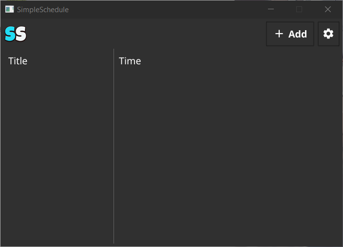
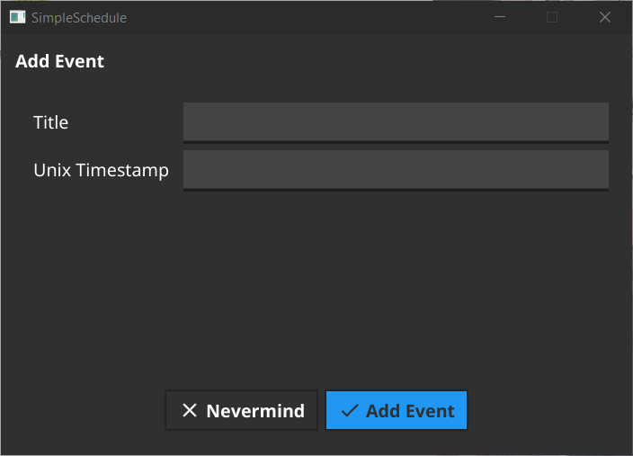
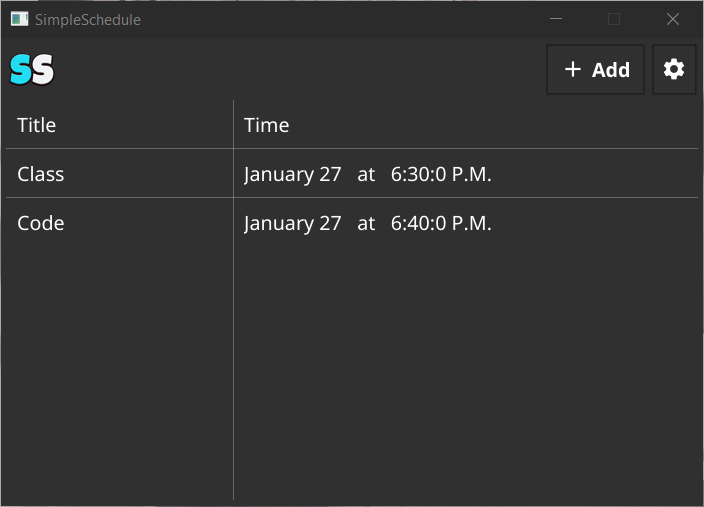
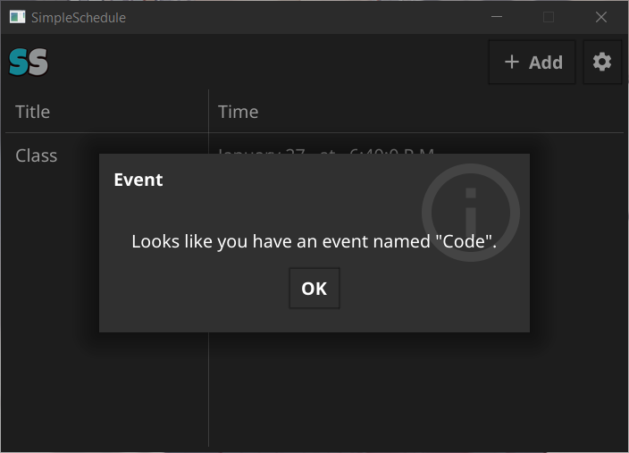

<p align="center">
    
</p>
<p align="center">
    <a href="https://go.dev/" alt="Made In">
        </a>
    <a href="https://github.com/NeutronX-dev/SimpleSchedule/releases/latest" alt="Version">
        </a>
    <a href="https://github.com/NeutronX-dev/SimpleSchedule/graphs/contributors" alt="Version">
        </a>
</p>

# <p align="center">Preview</p>

### No Items
<a src="./logos/screenshot/1.0.1/items.png">
    
</a>

#### This is what the program will look like when it is first installed, or you have no upcoming events
```json
[]
```

---

### Add Items
<a src="./logos/screenshot/1.0.1/add-item.png">
    
</a>

#### This is what the program will look like when you click on the "+ Add" Button
```json
[]
```

---

### With Items
<a src="./logos/screenshot/1.0.1/items.png">
    
</a>

#### This is what the program will look like when you add an event.
```json
[ {"title": "Class","timestamp": 1643326800000}, {"title": "Code","timestamp": 1643326200000} ]
```

---

### Event Past
<a src="./logos/screenshot/1.0.1/event-triggered.png">
    
</a>

#### This is what the program will look like when the time of an event passed. (as well as a sound effect)
```json
[ {"title": "Class", "timestamp": 1643326800000} ]
```

# <p align="center">Instructive</p>
For this to work the "Instructive" option should be enabled in the configuration. This is supposed to be typed in the "**Title**" input, on the add item window.
## <p align="center">**OPEN**</p>
### Syntax
```
i:OPEN[URL]
```
### Example
```
i:OPEN[https://google.com/]
```


# Exit Codes
* Loading Errors (3-5)
* * **3**: Error loading Config (might be unexpected JSON input or missing permissions)
* * **4**: --
* * **5**: --
* Normal Errors (6-??)
* * **6**: Closed and threads Dispatched

# LICENSE


This program is free software: you can redistribute it and/or modify
it under the terms of the [GNU General Public License](https://github.com/NeutronX-dev/ws.js/blob/main/LICENSE) as published by
the Free Software Foundation, either version 3 of the License, or
(at your option) any later version.

This program is distributed in the hope that it will be useful,
but WITHOUT ANY WARRANTY; without even the implied warranty of
MERCHANTABILITY or FITNESS FOR A PARTICULAR PURPOSE. See the
GNU General Public License for more details.

You should have received a copy of the GNU General Public License
along with this program. If not, see <https://www.gnu.org/licenses/>.
